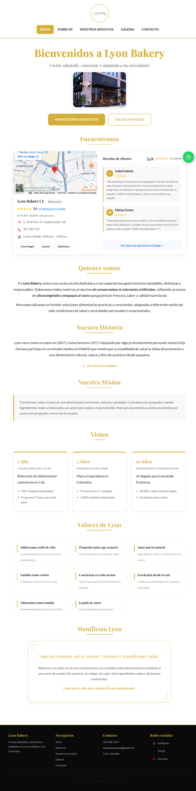

# Lyon Bakery — Sitio Web Empresarial

> Sitio web institucional para Lyon Bakery, cocina artesanal saludable en Cali, Colombia.
> Desarrollado con enfoque en experiencia de usuario, diseño responsive mobile-first y optimización SEO técnico.

---

## Vista previa



## Enlace en producción

🌐 [lyonbakerycl.com](https://lyonbakerycl.com)

---

## Tecnologías usadas

| Capa | Tecnología |
|---|---|
| Markup | HTML5 semántico |
| Estilos | CSS3 — Flexbox + Grid |
| Interactividad | JavaScript ES6+ vanilla (sin frameworks) |
| Fuentes | Google Fonts — Playfair Display + Lato |
| Formulario | Web3Forms API |
| Deploy | Hostinger |

---

## Estructura del proyecto

```
Lyon-Bakery/
├── index.html
├── sobre-mi.html
├── servicios.html
├── galeria.html
├── contacto.html
├── css/
│   └── style.css
└── assets/
    ├── images/       # Imágenes en formato .webp optimizadas
    ├── icons/        # Iconos SVG/webp (redes sociales, WhatsApp)
    ├── galeria/      # 24 imágenes de galería (.webp)
    └── docs/         # Menús descargables en PDF
```

---

## Instalación local

```bash
git clone https://github.com/AndresFelipe10/Lyon-Bakery.git
cd Lyon-Bakery
# Abrir index.html en el navegador o usar Live Server en VS Code
```

> No requiere dependencias ni gestor de paquetes. Proyecto 100% estático.

---

## Características implementadas

### UX / UI
- Diseño responsive mobile-first (breakpoints en 480px y 768px)
- Menú hamburguesa con accesibilidad (`aria-expanded`, `aria-controls`)
- Acordeones de menú con transición CSS y compensación de scroll programática
- Galería con lazy loading via `IntersectionObserver`, skeleton shimmer y lightbox navegable con teclado
- Botón flotante de navegación interna por sección
- Botón flotante de WhatsApp persistente

### SEO Técnico
- Etiquetas `<title>` y `<meta name="description">` optimizadas por página con keywords locales (Cali, Colombia)
- URLs canónicas (`<link rel="canonical">`) en todas las páginas
- Schema.org estructurado en JSON-LD:
  - `Bakery` con `geo`, `openingHoursSpecification` y `aggregateRating` en `index.html`
  - `Person` con `alumniOf` y `worksFor` en `sobre-mi.html`
  - `ItemList` con servicios enlazados por ancla en `servicios.html`
- Open Graph tags (`og:title`, `og:description`, `og:image`) para compartir en redes
- Contenido de acordeones visible para Googlebot sin JS (progressive enhancement con clase `.js-loaded`)
- `sitemap.xml` y `robots.txt` incluidos

### Rendimiento
- Imágenes en formato `.webp` en todas las páginas
- `fetchpriority="high"` en imágenes above-the-fold
- `loading="lazy"` en imágenes secundarias y de galería
- Fuentes con `<link rel="preconnect">` para reducir latencia

### Formulario de contacto
- Integración con Web3Forms API (sin backend propio)
- Rate limiting client-side: máximo 2 envíos por sesión, cooldown de 30 segundos
- Honeypot anti-bot por tiempo de relleno (< 3 segundos = bot)
- Validación visual de campos requeridos con feedback accesible (`role="alert"`, `aria-live`)

---

## Páginas

| Archivo | Descripción |
|---|---|
| `index.html` | Home: hero, historia, misión, visión, valores, reseñas Google y mapa |
| `sobre-mi.html` | Perfil de la chef fundadora Dariella Gómez |
| `servicios.html` | Catálogo completo: loncheras niños/adultos, pan artesanal, vinagretas, catering, cursos, maquila |
| `galeria.html` | Galería de 24 fotografías con lazy loading y lightbox |
| `contacto.html` | Formulario de contacto, datos y acceso directo a WhatsApp |

---

## Autor

**Andrés Felipe Grajales Campo**
- GitHub: [@AndresFelipe10](https://github.com/AndresFelipe10)
- LinkedIn: [www.linkedin.com/in/andres-felipe-grajales-campo-0956681a2]

---

## Cliente

**Lyon Bakery Cali** — Dariella Gómez
- Instagram: [@lyonbakery.co](https://www.instagram.com/lyonbakery.co/)
- TikTok: [@lyon_bakerycl](https://www.tiktok.com/@lyon_bakerycl)
- WhatsApp: [+57 301 238 7327](https://wa.me/573012387327)

---

*© 2026 Lyon Bakery. Todos los derechos reservados.*
